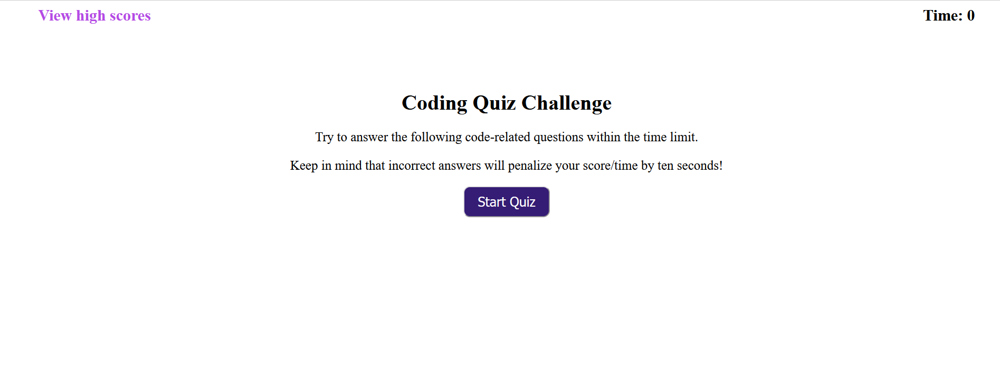

# Code Quiz

## Description
This application gives the user a quick quiz on coding. 
In particular, the user is quizzed on some basic aspects of web development.

Currently the quiz has five multiple-choice questions, and the user has 75 seconds to answer the questions. 
Ten seconds are deducted from the user's time when a question is answered incorrectly.

After the quiz is over, the user has the ability to save their high scores and initials in localStorage.
They can view their high scores after saving them or by clicking on "View high scores" in the main page.

The application utilizes JavaScript to dynamically update the HTML and CSS of the page.

## Link to site
https://patricklquirk.github.io/code-quiz/

## Image of site
